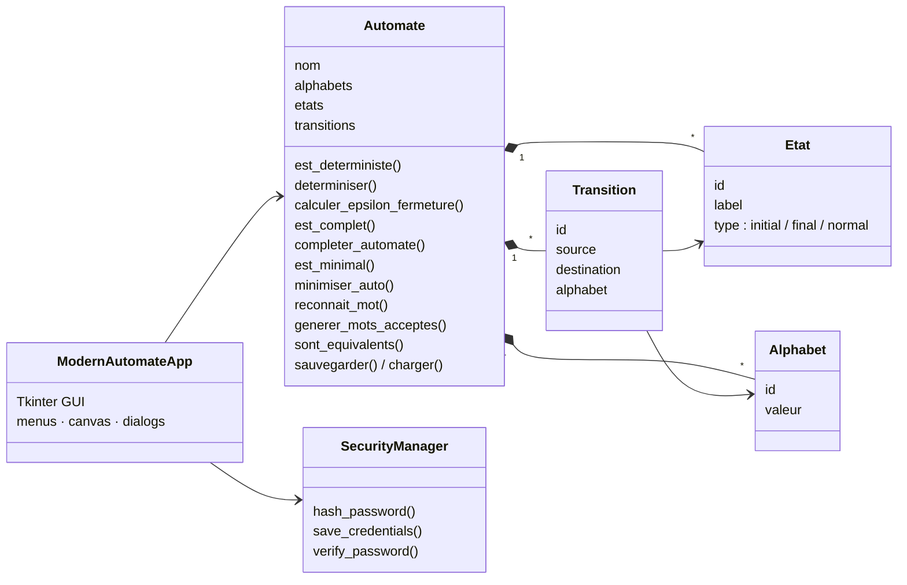

# Automate — Finite Automata Toolkit (Python / Tkinter)

> A desktop application to **build, visualize and analyze finite automata**: check determinism, completeness and minimality, convert an NFA to a DFA, complete and minimize automata, and test which words they accept. Built for the *Theory of Languages* course at ENSAM Casablanca.


*"Automate" is French for **automaton**.*

---

## Table of contents

- [Features](#features)
- [Screenshots](#screenshots)
- [Algorithms](#algorithms)
- [Architecture](#architecture)
- [File format](#file-format)
- [Getting started](#getting-started)
- [Example](#example)
- [Known issues](#known-issues)
- [Roadmap](#roadmap)
- [Author](#author)

---

## Features

**Build**
- Create an automaton, then add symbols to its alphabet, states (`initial`, `final`, `normal`) and transitions through dialog boxes
- **ε-transitions** are supported by using `ε` as a symbol
- Save and load automata as JSON files; each automaton is protected by its own password

**Visualize**
- Automatic drawing on a canvas: states on a circle, initial-state arrow, double circle for final states, self-loops, labels grouped per transition
- Text view with the alphabet, states and transitions

**Analyze and transform**

| Operation | Status |
|---|:---:|
| Is it deterministic? | ✅ |
| NFA → DFA (subset construction, with ε-closure) | ✅ |
| Is it complete? | ✅ |
| Complete it (adds a sink state `Puits`) | ✅ |
| Is it minimal? | ✅ |
| Minimize it | ✅ |
| Is a given word accepted? | ✅ |
| List accepted words up to length *n* | ✅ |
| List rejected words up to length *n* | ✅ |
| Equivalence of two automata, checked up to length *n* | ✅ |
| Union / intersection of two automata — as **sets of accepted words** up to length *n* | ✅ |
| Complement | ⏳ not implemented |
| Edit an existing automaton | ⏳ not implemented |

## Screenshots

<!-- TODO: add screenshots of the main window and the visualization tab, e.g.

-->

## Algorithms

### NFA → DFA — subset construction

Each DFA state represents a **set of NFA states**.

1. The initial DFA state is the **ε-closure** of the NFA's initial states: every state reachable from them using only ε-transitions.
2. For each DFA state and each symbol, the next state is the ε-closure of all NFA states reachable on that symbol.
3. New sets are added to a queue until none is left. A DFA state is final if it contains at least one final NFA state.

DFA states are named after the NFA states they contain (e.g. `q1_3` = {1, 3}).

### Completion

Every missing transition is redirected to a **sink state** (`Puits`) that loops to itself on every symbol, so that each state has exactly one transition per symbol.

### Minimization — Moore's algorithm

1. Remove **inaccessible** states (not reachable from the initial state).
2. Remove **non-co-accessible** states (from which no final state can be reached).
3. Start from the partition {final states, other states} and **refine** it: two states stay in the same group only if, for every symbol, their transitions lead to the same group. Repeat until the partition stops changing.
4. Each final group becomes one state of the minimal automaton.

The minimality check uses the same refinement: an automaton is minimal if it is deterministic, every state is accessible, and every group ends up with a single state.

### Word recognition and generation

- **Recognition** follows every possible path at once (the set of current states), so it works on NFAs as well as DFAs.
- **Accepted words** are generated by a breadth-first exploration of paths from the initial state, up to the chosen length.

## Architecture



| File | Role |
|---|---|
| `main.py` | Tkinter interface: menus, dialogs, canvas drawing |
| `classes/Automate.py` | The automaton and all its algorithms |
| `classes/Etat.py`, `Alphabet.py`, `Transition.py` | Model classes, with JSON serialization (`to_dict` / `from_dict`) |
| `classes/security.py` | Password hashing and verification |

The algorithms live in `classes/` and don't depend on the interface, so they can also be used from a script (see [Example](#example)).

## File format

Each automaton is saved as `automates/<name>.json`. Transitions reference states and symbols by id:

```json
{
  "nom": "testminim2",
  "alphabets":   [{ "idAlphabet": 1, "valAlphabet": "0" }, { "idAlphabet": 2, "valAlphabet": "1" }],
  "etats":       [{ "idEtat": 1, "labelEtat": "A", "typeEtat": "initial" }, "..."],
  "transitions": [{ "idTransition": 1, "etatSource": 1, "etatDestination": 2, "alphabet": 1 }, "..."]
}
```

Passwords are stored separately, as hashes, in `Automates/automate_credentials.csv`.

## Getting started

### Prerequisites

- **Python 3.9+** with Tkinter (included in the Windows and macOS installers; on Debian/Ubuntu: `sudo apt install python3-tk`)
- No other dependency

### Run

```bash
git clone https://github.com/AyoubElmortaji/Automate.git
cd Automate
python main.py
```

**Typical workflow:** *Automates → Créer un nouvel automate* → add symbols, states and transitions with the *Ajouter Symbole / État / Transition* buttons → *Sauvegarder l'automate actuel* → run checks and transformations from the *Analyse* and *Avancée* menus.

> The interface is in French.

## Example

The repository includes `testminim2`, the classic 5-state DFA over {0, 1} accepting words that **end with `011`**. Minimizing it merges states A and C, which behave identically, and gives a 4-state DFA that accepts exactly the same words.

The algorithms can be used without the interface:

```python
from classes import Automate

# Automate.charger() reads automates/<name>.json
dfa = Automate.charger("testminim2")

print(dfa.est_deterministe(), dfa.est_complet())     # True True
minimal = dfa.minimiser_auto()
print([e.label for e in minimal.etats])              # ['E', 'A', 'B', 'D']
print(minimal.reconnait_mot("1011"))                 # True
print(sorted(dfa.generer_mots_acceptes(4)))          # ['0011', '011', '1011']
```

> `charger()` looks in `automates/` (lowercase), while the sample file ships in `Automates/`. On Linux, copy it first: `mkdir -p automates && cp Automates/testminim2.json automates/`.

## Known issues

Found by testing the algorithms directly:

**Algorithms**
- **The DFA and minimal automaton have an empty alphabet.** `determiniser()` and `minimiser_auto()` build their result without copying the alphabet. The transitions are correct, but completeness checks on the result are meaningless, equivalence tests fail ("different alphabets"), and a saved result can't be reloaded (`KeyError`).
- **An initial state that is also final loses its final status** in `determiniser()`, so the DFA no longer accepts the empty word.
- **ε-transitions are only handled by the NFA → DFA conversion.** `est_deterministe()` treats `ε` as an ordinary symbol (an automaton with ε-transitions can be reported as deterministic), and `reconnait_mot()` doesn't follow ε-transitions.
- **States typed `initial_final`** (produced by minimization) aren't recognized by `generer_mots_acceptes()` and `generer_mots_rejetes()`, which compare the type with `==` instead of `in`.
- **Equivalence, union and intersection are bounded.** They compare words up to length *n*, which can't prove that two languages are equal. Union and intersection return word sets, not automata.

**Application**
- **Transformation results can't be saved from the interface.** They're named `<name>_AFD` / `<name>_minimal` and have no password, so the save dialog always answers "incorrect password".
- **Folder name case.** Automata are saved in `automates/` but credentials in `Automates/`, which are two different folders on Linux.
- **Password protection only covers the interface.** Automaton files are plain JSON that anyone can read or edit, deletion doesn't ask for the password, and passwords use SHA-256 with one fixed salt shared by all automata (`testminim` and `testminim2` have the same hash). The *Security info* screen reports every automaton as protected.

## Roadmap

- [ ] Copy the alphabet into the results of `determiniser()` and `minimiser_auto()`
- [ ] Keep the final status of an initial state during determinization
- [ ] Handle ε-transitions in `est_deterministe()` and `reconnait_mot()`
- [ ] Exact equivalence (minimize both automata and compare them, or explore the product automaton)
- [ ] Union, intersection and complement as automaton constructions (product automaton, swap final states)
- [ ] Editing of existing automata
- [ ] Unit tests (pytest) for each algorithm
- [ ] Export the drawing to an image (Graphviz)

## Author

**Ayoub ELMORTAJI** — Engineering student in Cybersecurity & Cloud Computing, ENSAM Casablanca · [GitHub](https://github.com/AyoubElmortaji)
